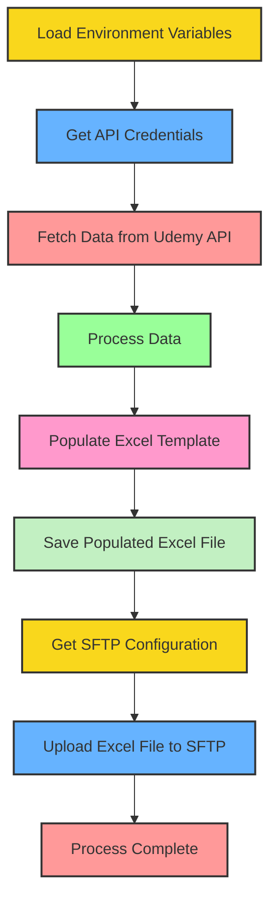

# Excel Data Population with SFTP Upload

## Description:

This project is a Python script that automates the process of fetching data from a Udemy API, populating an Excel file with the retrieved data, and uploading the resulting file to an SFTP server. It's designed to streamline the workflow of generating and distributing reports based on Udemy course activity.

### High-level flow


**Note: This is a prototype and should be used as a reference only. The author does not take any responsibility for this script.**

## Requirements:

- Python 3.6+
- pip (Python package installer)

## Installation:

1. Clone this repository:

```bash
> git clone https://github.com/yourusername/ub-sf-etl.git
> cd ub-sf-etl
```

2. Set up a virtual environment (recommended):

```bash
> python -m venv venv
> source venv/bin/activate
```

For more information on setting up a virtual environment, see the Python documentation: [https://docs.python.org/3/library/venv.html](https://docs.python.org/3/library/venv.html)

3. Install the required packages:

```bash
pip install python-dotenv requests openpyxl paramiko
```

## Configuration:

1. Create a `.env` file in the project root directory with the following content, refer to `.env_template` for references:

```
CLIENT_KEY=your_client_key
CLIENT_SECRET=your_client_secret
ACCOUNT_NAME=your_account_name
ACCOUNT_ID=your_account_id
SFTP_HOSTNAME=your_sftp_hostname
SFTP_PORT=22
SFTP_USERNAME=your_sftp_username
SFTP_PASSWORD=your_sftp_password
SFTP_REMOTE_PATH=/path/on/sftp/server
```

Replace the placeholder values with your actual credentials and configuration.

2. Ensure you have an Excel template file named template.xlsx in the same directory as the script.

## Usage:

Run the script using:

```bash
python script.py
```

## Script Actions

The script will:

1. Load environment variables
2. Get API credentials
3. Fetch data from the Udemy API
4. Process the retrieved data
5. Populate the Excel template with the processed data
6. Save the populated Excel file locally
7. Get SFTP configuration
8. Upload the file to the specified SFTP server

### Flow Chart:



## License:

This project is licensed under the MIT License. See the LICENSE file for details.

## Disclaimer:

This script is provided as-is, without any warranties or guarantees. It is intended to be used as a reference or starting point for similar projects. The author takes no responsibility for any issues or damages that may arise from its use. Always review and test the code thoroughly before using it in a production environment.
